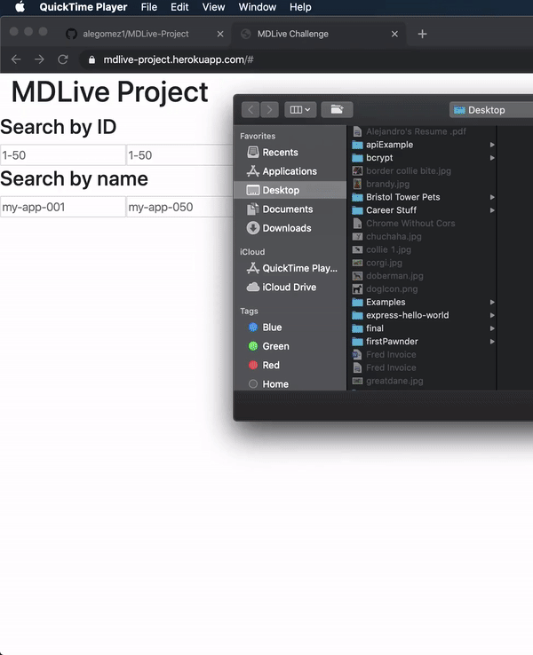

# MDLive QA Challenge

## Table of Contents
- [About](#about)
- [Setup](#setup)
- [Endpoints](#endpoints)
- [Testing](#testing)
- [Author](#author)


<br>
Demo of frontend interface

## About <a name="about"></a>

This project was done as part of MDLive’s QA Challenge. My solution was to use a Node.js Express server that would be the endpoint for all queries. I made an optional frontend search interface with pagination using React.js. The frontend was created so there would be a visual aspect to the project, with the option of viewing the JSON data.

The endpoints for the server are meant to return JSON data depending on the parameters passed to it, and what queries they contain. For example, if a user wants to see all available data items, they can navigate to /apps. If more specificity is needed, parameters can be passed in the URL. These parameters were sorted in the following manner:

- Check to see if rangeBy is set to id or name
- Run if statements to check for cases when certain queries are undefined or greater than the permitted values
- Run a switch statement, with the cases being id or name
- Narrow the items being searched for by start and end values
- Add those items to a new array which is displayed in JSON format

There’s added logic to see if a max items query is passed, as well as whether the user wants the info in ascending or descending order. 

For more details on the code and logic used, please refer to the comments and documentation inside of the code.

## Setup <a name="setup"></a>

### Installation

*   Clone the [repo]('https://github.com/alegomez1/MDLive-project/')
*   Use ```npm install``` or ```yarn install``` to install the necessary dependencies
*   Run the server using ```cd server``` followed by ```npm start``` or ```yarn start```
*   Run the optional client frontend using ```cd client``` followed by ```npm start``` or ```yarn start```
*   Open ```http://localhost:5000``` in your browser for the server and/or ```http://localhost:3000``` for frontend site

## Endpoints <a name="endpoints"></a>

| Queries |
| --- |
| https://mdlive-project.herokuapp.com/apps |
| https://mdlive-project.herokuapp.com/apps?rangeBy=id&start=1&end=50 |
| https://mdlive-project.herokuapp.com/apps?rangeBy=name&start=my-app-001&end=my-app-050 |
| https://mdlive-project.herokuapp.com/apps?rangeBy=id&start=1&end=40&max=30&order=desc |
| https://mdlive-project.herokuapp.com/apps?rangeBy=id&start=30&end=50&max=7&order=asc |
| https://mdlive-project.herokuapp.com/apps?rangeBy=name&start=my-app-020&end=my-app-045&max=15&order=desc |
| https://mdlive-project.herokuapp.com/apps?rangeBy=name&start=my-app-040&end=my-app-045&max=3&order=asc |

#### Basic Frontend Interace
 https://mdlive-project.herokuapp.com
 
 ## Testing <a name="testing"></a>
 
Automatic testing is done using [Mocha](https://mochajs.org/) and [Chai](https://www.chaijs.com/)
- After cloning the repo and runing ```npm install``` run ```npm test```

## Created using:
* [React.js](https://reactjs.org/) - Frontend design
* [Javascript](https://www.javascript.com/) - Frontend and backend
* [Express.js](https://expressjs.com/) - Backend server
* [Mocha](https://mochajs.org/) - Testing
* [Chai](https://www.chaijs.com/) - Testing


## Created by: <a name="author"></a>
* [Alejandro Gomez](https://github.com/alegomez1)
