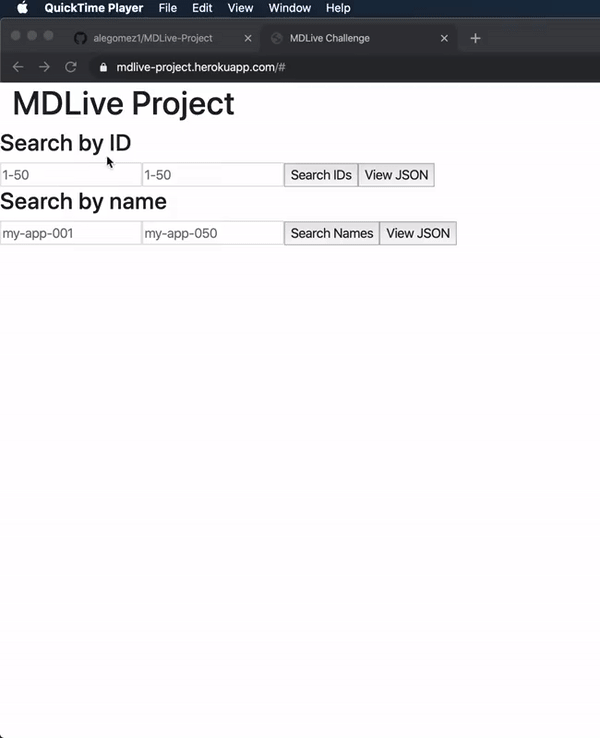

# MDLive QA Challenge

## Table of Contents
- [About](#about)
- [Setup](#setup)
- [Endpoints](#endpoints)
- [Testing](#testing)
- [Author](#author)


<br>
Demo of the frontend interface -  https://mdlive-project.herokuapp.com

## About <a name="about"></a>

### Process

1. Create a backend server using Express and Node.js. This would be the endpoint for all queries.
2. Provided seed data in the form of a list.json file.
3. Added the necesessary /apps? routes to the server, and added manual pagination.
4. Queries were sorted in the following manner:

   - Check to see if rangeBy is set to id or name
   - Run if statements to check for edge cases when certain queries are undefined or greater than the permitted values
   - Run a switch statement, whose paramater was the rangeBy value
   - Narrow the items being searched for by their start and end values
   - Add those items to a new array which is displayed in JSON format
   - If the order was set to ascending(asc) the array was returned normally, otherwise it was returned reversed for     
     descending(desc) order
     
5. Create a frontend interface using [React.js](https://reactjs.org/) to showcase clientside pagination. 
6. Deploy to Heroku once both frontend and backend were properly integrated.
7. Create automatic testing using [Mocha](https://mochajs.org/) and [Chai](https://www.chaijs.com/) to test endpoints for the app, as well as different queries being 
   passed through
   
#### For more details on the code and logic used, please refer to the comments and documentation inside of the code.*

## Setup <a name="setup"></a>

### Installation

*   Clone the [repo]('https://github.com/alegomez1/MDLive-project/')
*   Use ```npm install``` or ```yarn install``` to install the necessary dependencies
*   Run the server using ```cd server``` followed by ```npm start``` or ```yarn start```
*   Run the optional client frontend using ```cd client``` followed by ```npm start``` or ```yarn start```
*   Open ```http://localhost:5000``` in your browser for the server and/or ```http://localhost:3000``` for frontend site

## Endpoints <a name="endpoints"></a>

| Queries |
| --- |
| https://mdlive-project.herokuapp.com/apps |
| https://mdlive-project.herokuapp.com/apps?rangeBy=id&start=1&end=50 |
| https://mdlive-project.herokuapp.com/apps?rangeBy=name&start=my-app-001&end=my-app-050 |
| https://mdlive-project.herokuapp.com/apps?rangeBy=id&start=1&end=40&max=30&order=desc |
| https://mdlive-project.herokuapp.com/apps?rangeBy=id&start=30&end=50&max=7&order=asc |
| https://mdlive-project.herokuapp.com/apps?rangeBy=name&start=my-app-020&end=my-app-045&max=15&order=desc |
| https://mdlive-project.herokuapp.com/apps?rangeBy=name&start=my-app-040&end=my-app-045&max=3&order=asc |

#### Basic Frontend Interace
 https://mdlive-project.herokuapp.com
 
 ## Testing <a name="testing"></a>
 
Automatic testing is done using [Mocha](https://mochajs.org/) and [Chai](https://www.chaijs.com/)
- After cloning the repo, run ```npm install```and then ```npm test```
- This series of tests account for different range options, whether or not certain queries are passed, etc.
- There are also edge cases when values are entered that are outside the scope of the data set.

## Created using:
* [React.js](https://reactjs.org/) - Frontend design
* [Javascript](https://www.javascript.com/) - Frontend and backend
* [Express.js](https://expressjs.com/) - Backend server
* [Mocha](https://mochajs.org/) - Testing
* [Chai](https://www.chaijs.com/) - Testing


## Created by: <a name="author"></a>
* [Alejandro Gomez](https://github.com/alegomez1)
